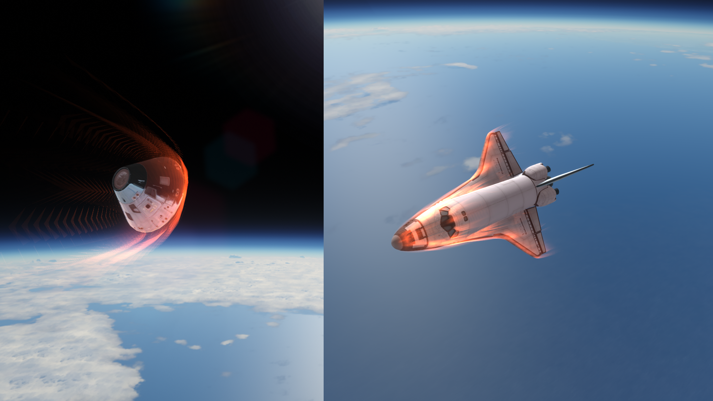

# Chris GNC Suite
Advanced guidance and control research for Kerbal Space Program.

Chris GNC Suite is a powerful autopilot mod containing PEGLand and UEntry programs that enable precise spacecraft landings on the Moon or Earth.
See [Installation](#installation) for installation instructions, and read the [Tutorial](./docs/English/README.md) to learn how to use it.

## Videos

- [[KSP/RSS/RO]PEGLand: 你也许能找到的最方便的定点着陆脚本](https://www.bilibili.com/video/BV1wDd2YDEf1)
- [[KSP/RSS/RO]PEGLand v0.3: 早期探测器一键自动定点落月](https://www.bilibili.com/video/BV1ZJdZY6EwE)
- [[KSP/RSS/RO]PEGLand v0.3阿波罗登月特别版：厘米级优雅着陆](https://www.bilibili.com/video/BV1wGdZYjEgm)
- [[KSP/RSS/RO]PEGLand 0.7: 通用定点着陆制导，支持目视修正](https://www.bilibili.com/video/BV1yUT6z4ExF)

## MOD List

- KSP 1.12.5
- kOS: Scriptable Autopilot System 1.4.0.0
- KSPBurst Compiler 1.5.5.2 (Required by UEntry)
- Ferram Aerospace Research Continued 0.16.1.2 (Required by UEntry)
- WaypointManager (Recommended for PEGLand and UEntry)
- Atmosphere Flight Simulator (Included in installation package)

## Installation

After installing all mod dependencies, download the installation package from the latest release (`Chris_KSP_Lib.zip`). After extraction, you will see two folders:

- `Script`: Move it to the `<KSP Root Directory>\Ships\` folder. When complete, the path `<KSP Root Directory>\Ships\Script\pegland.ks` should exist.
- `GameData`: Move it to the `<KSP Root Directory>\` folder. When complete, the path `<KSP Root Directory>\GameData\kOS-Addons\AFS\kOS-AFS.dll` should exist.

## Tutorial

[Tutorial](./docs/English/README.md)
