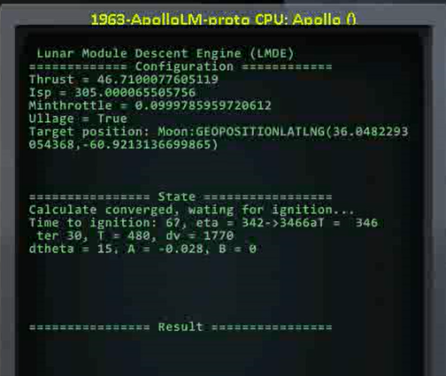

# Chris_KSP_Lib

kOS scripts for KSP stock or RSS/RO environments.

Video:

- [[KSP/RSS/RO]PEGLand: 你也许能找到的最方便的定点着陆脚本](https://www.bilibili.com/video/BV1wDd2YDEf1)
- [[KSP/RSS/RO]PEGLand v0.3: 早期探测器一键自动定点落月](https://www.bilibili.com/video/BV1ZJdZY6EwE)
- [[KSP/RSS/RO]PEGLand v0.3阿波罗登月特别版：厘米级优雅着陆](https://www.bilibili.com/video/BV1wGdZYjEgm/?share_source=copy_web&vd_source=c95e75114f56a5367c332dfeef079f60)

## MOD List

- KSP-1.12.5
- kOS: Scriptable Autopilot System-1.4.0.0
- Trajectories-v2.4.5.3 (For pegland)
- WaypointManager (Recommended for pegland)

## PEG Landing

`pegland` is the highlight of this script package, adapted from the PEG launch guidance algorithm developed by NASA in the 1960s for the Surveyor project. It achieves fuel-optimal pinpoint landing in a vacuum environment with an error margin within 30 m.

Reference: [Explicit guidance equations for multistage boost trajectories](https://ntrs.nasa.gov/citations/19660006073)

```kOS
run pegland(P_NOWAIT, P_ALLO_RESTART, P_ENGINE)
Parameters:
   P_NOWAIT: Start the descent program immediately without waiting to glide to the ignition point. Default is false.
   P_ALLO_RESTART: Allow engine to restart, consuming two ignitions. Default is true.
   P_ENGINE: Engine mode.
      "current": (Default) Use the currently activated engine.
      "auto": Automatic staging. Automatically activate the next stage when the current stage is burnout.
      <tag>: Search for an engine matching the tag and activate it at ignition. Especially useful for solid rockets.
```

**Examples:**

```kOS
run pegland.  // Start descent at the optimal time, two ignitions, using the currently activated engine.
run pegland(1). // Start the engine immediately for descent.
run pegland(0, 0). // Allow only one engine ignition.
run pegland(0, 0, "descent"). // Search for the engine tagged "descent" and activate it at ignition.
run pegland(0, 0, "auto"). // Automatic staging.
```

Requirements for using this program:

1. Ensure the spacecraft meets landing requirements: sufficient Δv, final phase $TWR_{min} < 1$.

2. Proper initial orbit and landing point, with the landing point approximately below the periapsis.

3. Set the landing target in the Trajectories mod window. It is highly recommended to use it with WaypointManager:
   1. Create a waypoint on the map using WaypointManager and set navigation to this waypoint.

      

   2. Use the active waypoint as the landing target in Trajectories.

      

`pegland` in default mode has three phases:

1. Estimation of ignition position: Iteratively calculates ignition position, time, and initial control parameters.

   

   ```
   Time to ignition: Countdown to ignition
   T: Estimated landing burn time
   dv: Estimated landing burn Δv
   dtheta: Distance from ignition start position to target position (angle in central body polar coordinates)
   A, B: Pitch control parameters
   ```

2. Powered descent: Automatically adjusts attitude 60s before ignition, performs ullage maneuver and ignition 2s before ignition. Control parameters are iteratively updated during the burn. The throttle remains above the engine's minimum throttle, preventing engine shutdown.

   

   ```
   Iter: Number of calculation iterations
   T: Estimated remaining burn time
   dv: Estimated remaining burn Δv
   A: Pitch control parameter
   thro: Throttle
   E: Landing position error, positive value indicates landing point is over the target
   ```

3. Final Landing: Adjusts attitude upwards at about 200m above the target point, cancels horizontal velocity, and lands. This phase introduces the main landing error as it does not aim for the target point. A more refined final landing guidance algorithm will be added in future updates.

If the user changes the landing point during descent, the landing program can be interrupted and rerun in emergency mode. The program will then ignite and descend immediately without waiting for gliding to the ignition position.

### Notes

- Supports limited-throttle and non-throttleable engines. When the lower throttle limit is above 60%, landing precision cannot be guaranteed, and when the final phase thrust-to-weight ratio is above 1.5, landing is unsafe.
- If you do not want the engine to shut down, set the parameter `P_ALLO_RESTART = 0`, but ensure the final phase thrust-to-weight ratio is less than 1, or the rocket will not be able to land.
- Although beyond the scope of the current algorithm, the script supports multi-stage rocket landings. Set `P_ENGINE = "auto"`, and the script will automatically stage when the current stage is burnout. For manual staging, turn off the engine manually before staging, or the debris might collide with the spacecraft. Landing precision cannot be guaranteed.
- If you need to use solid rockets for deceleration, it is recommended to set `P_ENGINE = <tag>`. Apparently, solid rockets generally cannot be used in the final landing phase, because they cannot be turned off. Instructions for this tricky landing:
  1. Assign tag for the braking engines, like "descent"
  2. Run PEGLand: `run pegland(0,0,"descent")`
  3. When the braking engines burn out, stage manually, the PEGLand program will be aware of the chaning in stage number , updating engine parameters, and finish landing with new engines.
- If you need to switch engine in flight, please press "0" key after switching. The process will monitor chaning on action group No.10 to update engine information.

### Apollo LM Landing program

`peglandprec` is a program for precise landing. Though it was designed for the Apollo LM, I tried my best to make it suitable for other landers.

```kOS
run peglandprec(P_NOWAIT, P_ENGINE)
Parameters:
   P_NOWAIT: Start the descent program immediately without waiting to glide to the ignition point. Default is false.
   P_ENGINE: Engine mode.
      "current": (Default) Use the currently activated engine.
      "auto": Automatic staging. Automatically activate the next stage when the current stage is burnout.
      <tag>: Search for an engine matching the tag and activate it at ignition
```

Compared to `pegland`, this program adds a "approch phase" controled by quadratic guidance behind the "descent phase". Because the throttle constraints may not be satisfied in quadratic guidance algorithm, the initial condition must be sophiscatedly adjusted by the previous descent phase. In approach phase, the lander will slowly fly to the target and perform an elegant landing, with error less than 1 cm. To use `peglandprec`, you need:

- Deep throttling engine: final phase $TWR_{min} < 1$
- Cost 5% more fuel than `pegland`
- Single-stage lander

## Executing Maneuver Nodes

`exe_node` and `exe_pulse_node` are two high-precision maneuver node execution programs for the Principia environment. Maneuver nodes planned in Principia consider the burn process, taking into account changes in burn direction and position, as well as celestial gravitational influences during long maneuvers. Additionally, the thrust of RO engines is not constant, making burn time inaccurate for calculating Δv. `exe_node` and `exe_pulse_node` do not use timing methods; instead, they maintain a Δv integrator to precisely monitor the accumulated Δv during the burn.

- `exe_node` executes Principia maneuver nodes, starting ignition from the node position, always following the burn vector.
- `exe_pulse_node` executes stock maneuver nodes, starting ignition at `T/2` before the node position.

## Planning Orbital Circularization Maneuvers

Running `circularize` will plan an acceleration maneuver node at the apoapsis to circularize the orbit. `circularize(1)` plans a deceleration maneuver at the periapsis.
