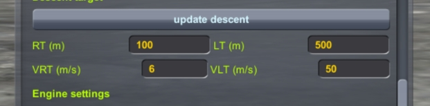
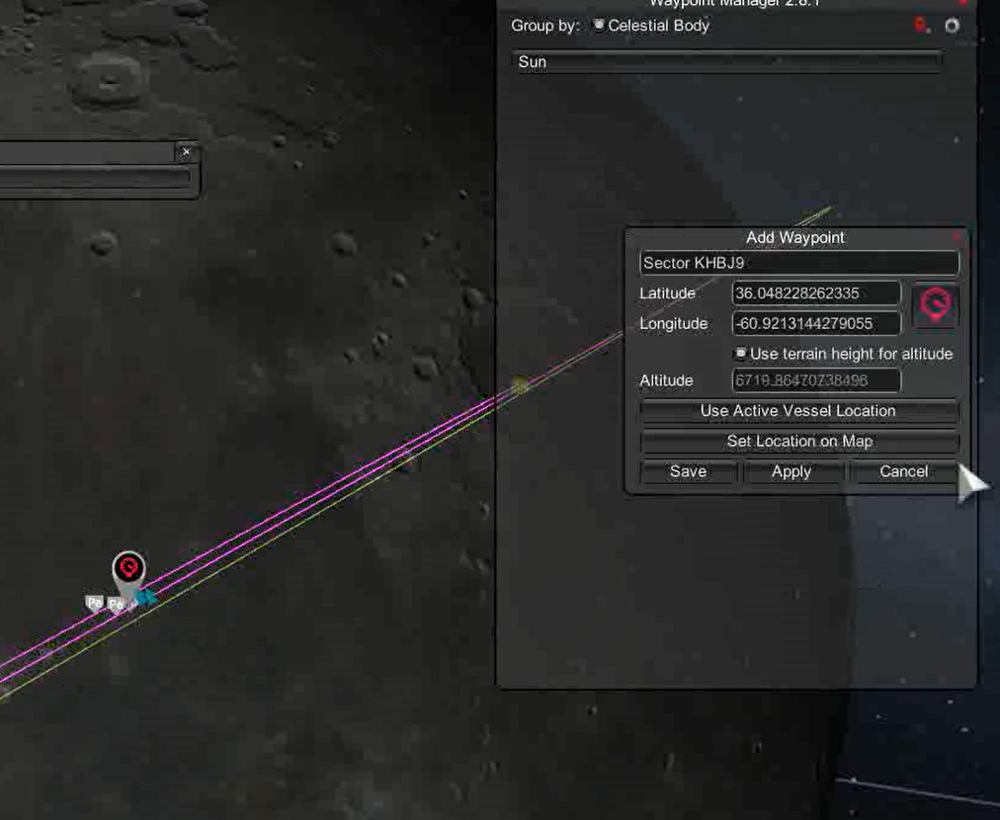

# Chris_KSP_Lib

kOS scripts for KSP stock or RSS/RO environments.

Video:

- [[KSP/RSS/RO]PEGLand: 你也许能找到的最方便的定点着陆脚本](https://www.bilibili.com/video/BV1wDd2YDEf1)
- [[KSP/RSS/RO]PEGLand v0.3: 早期探测器一键自动定点落月](https://www.bilibili.com/video/BV1ZJdZY6EwE)
- [[KSP/RSS/RO]PEGLand v0.3阿波罗登月特别版：厘米级优雅着陆](https://www.bilibili.com/video/BV1wGdZYjEgm/?share_source=copy_web&vd_source=c95e75114f56a5367c332dfeef079f60)

## MOD List

- KSP-1.12.5
- kOS: Scriptable Autopilot System-1.4.0.0
- Trajectories-v2.4.5.3 (For pegland)
- WaypointManager (Recommended for pegland)

## PEG Landing

`pegland` is the most exciting part of this script package, adapted from the PEG launch guidance algorithm developed by NASA in the 1980s for the Space Shuttle program. It enables fuel-optimal pinpoint landings in a vacuum environment.

Reference: [An explicit solution to the exoatmospheric powered flight guidance and trajectory optimization problem for rocket propelled vehicles | Guidance, Navigation, and Control and Co-located Conferences](https://arc.aiaa.org/doi/10.2514/6.1977-1051)

### Algorithm Principles

PEGLand includes three guidance phases:

- **Descent Phase**: Decelerates from the landing orbit aiming near the landing point. It first estimates the ignition position and, upon coasting to this position, uses the PEG algorithm to iteratively predict the landing point and update control parameters for a fuel-optimal descent. This phase is precise if the spacecraft engine can throttle to 60%.

- **Approach Phase**: Moves slowly from near the landing point to 50 cm above it. Uses the same quadratic guidance algorithm as the Apollo missions to reduce landing error to the decimeter level. This phase requires a deep-throttling engine to allow hovering. It can be skipped if the spacecraft lacks this capability.

- **Final Phase**: Descends slowly from above the landing point, eliminating lateral velocity, and touches down at 5 cm/s.

### Using PEGLand

```kOS
run pegland(P_GUI, P_PREC, P_NOWAIT, P_ADJUST, P_ENGINE)
Parameters:
   P_GUI: Open GUI. Default is true
   P_PREC: Add approach phase for high-precision landing. Default is false
   P_NOWAIT: Start descent program immediately without waiting to coast to ignition position (i.e., ignite_now in the GUI window). Default is false
   P_ADJUST: Target correction vector. Default is V(0,0,0)
   P_ENGINE: Engine mode.
      “current”: (default) Use currently activated engines
      <label>: Search for engines matching the label and activate at ignition. Especially useful for solid rockets
```

**Examples:**

```kOS
run pegland.  // Open PEGLand GUI
run pegland(0,1,1). // Do not open GUI, start engine descent immediately, add approach phase
run pegland(0,0,0,V(0,0,0),"descent"). // Do not open GUI, use engines labeled "descent"
run pegland(0,0,0,V(-50,10,1)).  // Move target: 50m south, 10m east, 1m up
```

### PEGLand GUI

In most cases, you can perform guidance settings with one click in the PEGLand GUI and dynamically adjust parameters during landing. Basic settings include:

- `active`: Activate/stop the guidance program. Activating this button will start the guidance program immediately and execute the landing as planned. Stopping will reset the program to initial state.
- `Ignite Now`: Ignite immediately without waiting for coasting to the ignition position.
- `Add Approach Phase`: Add approach phase for precise landing.
- `start phase`: Choose which guidance phase to start from. If you are already close to the ground and moving slowly, you can start soft landing from the `final phase`.
- `Rotation`: Spacecraft roll angle.


#### Adjusting the Landing Point

You can click `current waypoint` or manually enter the landing point's latitude and longitude, **and click `update target`** to set the landing point. If you find the original landing point unsuitable during descent, PEGLand provides a convenient visual adjustment feature. Click `show target` to display the landing location on the HUD, then use the adjustment buttons to move the landing point in any direction. The distance moved with each click can be set in `Moving step`.

**Note:**

- Only the descent and approach phases allow landing point adjustments.
- Excessive adjustments may cause guidance divergence.
- Adjust as early as possible when far from the landing point.
- For spacecraft without throttling capability, adjusting the landing point may not be helpful.


#### Adjusting Descent Phase Targets

Descent phase targets need manual setting, though default settings are usually sufficient. You may need to adjust these parameters for the approach phase to perform as expected:




The main descent phase target is defined by four parameters:

- `RT`: Altitude above ground
- `VRT`: Vertical descent speed
- `LT`: Horizontal distance to target
- `VLT`: Horizontal speed

The approach phase duration is approximately $4.5 \times LT/VLT$. A longer approach phase wastes fuel and may exceed throttle limits, while a shorter one may reduce landing precision.

#### Tips

1. Ensure the spacecraft meets landing requirements: sufficient Δv. If the final phase thrust-to-weight ratio range includes 1, it's recommended to add an approach phase for a smoother landing.

2. Choose an appropriate initial orbit and landing point, with the landing point roughly below the orbit's periapsis. If the landing point is far off the orbit plane, PEGLand can still work perfectly, but at the cost of more fuel.

3. In both GUI and command-line modes, PEGLand will try to read the active waypoint. You can set waypoints using WaypointManager to avoid manually entering latitude and longitude.

   

4. For engines with limited or no throttling, landing precision cannot be guaranteed (neither by the geniuses at NASA). However, you can simulate the landing first, then load a previous save and adjust the landing point based on the error to reduce it to within 100 meters.

5. If the thrust-to-weight ratio lower limit is above 2 during final landing, be cautious, this is even more risky than Falcon 9's suicide burn.

6. Currently, PEGLand only supports single-stage rocket landings, but you can switch engines or stages during landing and press the "0" key to update engine parameters. PEGLand will not be optimized for multi-stage rockets in the future, as predicting future stage engine parameters is fxxking hell complicated.

## Executing Maneuver Nodes

`exe_node` and `exe_pulse_node` are two high-precision maneuver node execution programs for the Principia environment. Maneuver nodes planned in Principia consider the burn process, taking into account changes in burn direction and position, as well as celestial gravitational influences during long maneuvers. Additionally, the thrust of RO engines is not constant, making burn time inaccurate for calculating Δv. `exe_node` and `exe_pulse_node` do not use timing methods; instead, they maintain a Δv integrator to precisely monitor the accumulated Δv during the burn.

- `exe_node` executes Principia maneuver nodes, starting ignition from the node position, always following the burn vector.
- `exe_pulse_node` executes stock maneuver nodes, starting ignition at `T/2` before the node position.

## Planning Orbital Circularization Maneuvers

Running `circularize` will plan an acceleration maneuver node at the apoapsis to circularize the orbit. `circularize(1)` plans a deceleration maneuver at the periapsis.
