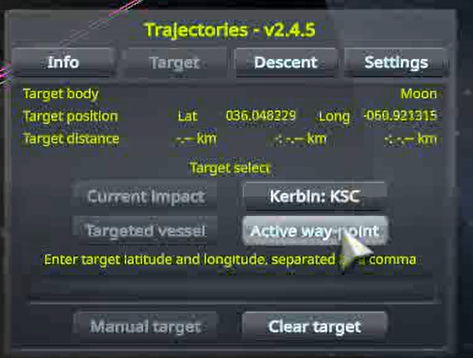
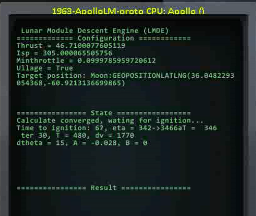
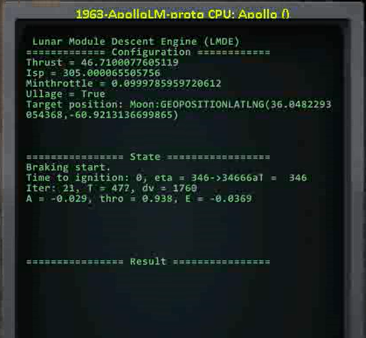

# Chris_KSP_Lib
适用于KSP原版或RSS/RO环境的KOS脚本。

视频演示：

- [[KSP/RSS/RO]PEGLand: 你也许能找到的最方便的定点着陆脚本](https://www.bilibili.com/video/BV1wDd2YDEf1)
- [[KSP/RSS/RO]PEGLand v0.3: 早期探测器一键自动定点落月](https://www.bilibili.com/video/BV1ZJdZY6EwE)
- [[KSP/RSS/RO]PEGLand v0.3阿波罗登月特别版：厘米级优雅着陆](https://www.bilibili.com/video/BV1wGdZYjEgm/?share_source=copy_web&vd_source=c95e75114f56a5367c332dfeef079f60)

## MOD 列表

- KSP-1.12.5
- kOS: Scriptable Autopilot System-1.4.0.0
- Trajectories-v2.4.5.3  (For pegland)
- WaypointManager (Recommended for pegland)

## PEG 着陆

`pegland`是这个脚本包中最精彩的程序，从1960s NASA为Surveyor项目开发的PEG发射制导算法修改而来，实现真空环境下燃料最优的定点着陆，误差在30 m内。

参考文献：[Explicit guidance equations for multistage boost trajectories](https://ntrs.nasa.gov/citations/19660006073)

```kOS
run pegland(P_NOWAIT, P_ALLO_RESTART, P_ENGINE)
参数:
   P_NOWAIT: 立刻启动下降程序，不要等待滑行至点火位置，默认为 false
   P_ALLO_RESTART: 允许发动机重启，这会消耗两次点火次数。默认为 true
   P_ENGINE: 引擎模式。
      “current”: (默认)使用当前已激活的引擎
      “auto”: 自动分级。当前分级燃尽时自动激活下一分级
      <标签>: 搜索符合标签的引擎，在点火时激活。在固体火箭时尤其有用
```

**示例：**

```kOS
run pegland.  // 在最优时机启动下降，两次点火，使用当前激活的引擎
run pegland(1). // 立刻启动引擎执行下降
run pegland(0, 0). // 仅允许引擎点火一次
run pegland(0, 0, "descent"). // 搜索标签为"descent"的引擎，在点火时启动它
run pegland(0, 0, "auto"). // 自动分级
```

使用该程序需要：

1. 确保航天器满足着陆要求：充足的Δv，末段推重比范围包含1

2. 合适的初始轨道和着陆点，着陆点大概在轨道近地点下方

3. 通过Trajectoties mod窗口设置着陆目标。强烈推荐组合WaypointManager使用：
   1. 通过WaypointManager在地图中创建导航点，并设置到目标的导航

      

   2. 在Trajectories中采用激活的导航点作为着陆目标

      

`pegland`默认模式下有三个阶段：

1. 点火位置估计：迭代计算点火位置、时间和初始控制参数。

   

   ```
   Time to ignition: 点火倒计时
   T: 估计着陆燃烧时间
   dv: 估计着陆燃烧Δv
   dtheta: 点火开始位置与目标位置距离（中心天体极坐标下的角度）
   A, B: 俯仰控制参数
   ```

2. 动力下降：点火-60s自动调整姿态，点火-2s执行燃料沉底并点火，燃烧期间迭代更新控制参数。在着陆过程中油门始终高于引擎允许的最低油门，因此不会熄火。

   

   ```
   Iter: 计算迭代次数
   T: 估计剩余燃烧时间
   dv: 估计剩余燃烧Δv
   A: 俯仰控制参数
   thro: 油门
   E: 着陆位置误差，正值表示着陆点在目标后方
   ```

3. 末段着陆：在目标点上方大约150m处调整姿态，消除水平速度并着陆。这一阶段没有瞄准目标点，因此引入了主要的着陆误差。我会在后续更新中加入更完善的末端着陆制导算法。

如果用户在下降途中修改了着陆点，可以中断着陆程序，以紧急模式重新运行。此时程序将直接点火下降，而无需等待运行到点火位置。

### 注意事项

- 支持浅节流和不节流发动机。当节流范围下限高于60%时，无法保证着陆精度，末段推重比下限高于1.5时，着陆不安全。
- 如果不希望发动机熄火，请设置参数 `P_ALLO_RESTART = 0`，但需要保证末段推重比下限小于1，否则火箭无法着陆。
- 尽管超出了当前算法的处理范围，该脚本支持多级火箭着陆。设置`P_ENGINE = "auto"`，当前分级燃尽时，脚本会自动分级。如果需要手动分级，请在分级之前手动关闭发动机，否则分离后的残骸可能会撞上航天器。无法保证着陆点精度。
- 如果需要使用固体火箭完成减速，建议设置 `P_ENGINE = <tag>`，并在固体火箭燃尽时手动分级。但显然，固体火箭一般无法在最终着陆段使用，因为它关不掉。具体操作：
  1. 给用于减速的引擎设置tag，比如"descent"
  2. 运行PEGLand: `run pegland(0,0,"descent")`
  3. 当减速引擎燃尽时，按下空格分级，着陆程序会检测到当前分级的变化并更新引擎参数，继续完成着陆。
- 如果需要在飞行中切换引擎，请在切换后按下"0"键，程序会检测到10号动作组被激活并更新引擎参数。

### Apollo LM 着陆程序

`peglandprec`是精确着陆脚本，尽管是专门为Apollo LM设计的，但我尽可能让这个脚本能够适用于其他的着陆器。

```
run peglandprec(P_NOWAIT, P_ENGINE)
参数:
   P_NOWAIT: 立刻启动下降程序，不要等待滑行至点火位置，默认为 false
   P_ENGINE: 引擎模式。
      “current”: (默认)使用当前已激活的引擎
      “auto”: 自动分级。当前分级燃尽时自动激活下一分级
      <标签>: 搜索符合标签的引擎，在点火时激活
```

`peglandprec`将动力下降段的目标前移500米，并在后面添加了由二次制导控制的接近段。由于二次制导不一定满足油门约束，需要由主下降段确保接近段起点在合理范围。接近段会控制航天器以低油门缓缓前进到目标上方并以朝上的姿态下降。误差小于1 cm。使用`peglandprec`程序需要：

- 深度节流引擎：末段推重比下限小于1
- 比`pegland`多消耗约5%的燃料
- 着陆器不能在中途分级

## 执行机动节点

`exe_node`和`exe_pulse_node`是两个适用于Principia环境下的高精度机动节点执行程序。在Principia中规划的机动节点考虑了燃烧过程，在时间较长的机动节点中，期间燃烧方向和位置的变化，以及天体引力的影响不可忽略。另外，RO发动机的推力不恒定，导致燃烧计时无法精确反映Δv。`exe_node`和`exe_pulse_node` 不采用计时的方法，而是通过维护一个Δv积分器直接精确监测燃烧过程中积攒的Δv.

- `exe_node`执行Principia机动节点，点火从节点位置开始，始终跟随目标燃烧矢量
- `exe_pulse_node`执行stock机动节点，点火从节点位置前`T/2`时刻开始

## 规划轨道圆化机动

执行`circularize`会在远地点规划一个加速机动节点以圆化轨道。`circularize(1)`在近地点规划减速机动。

