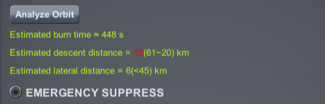
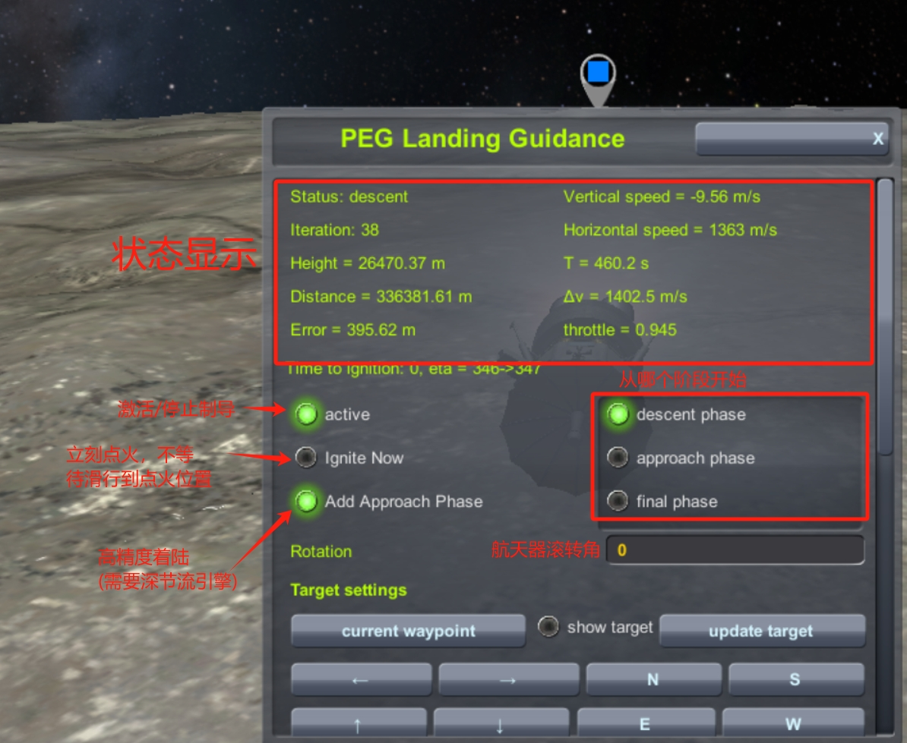
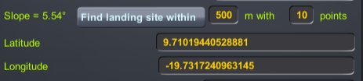
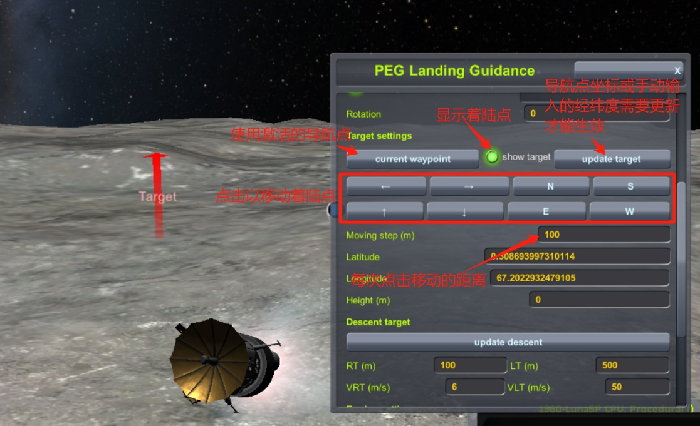
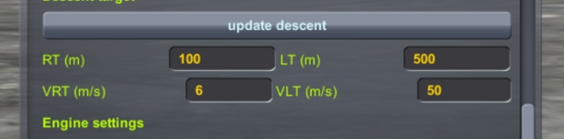
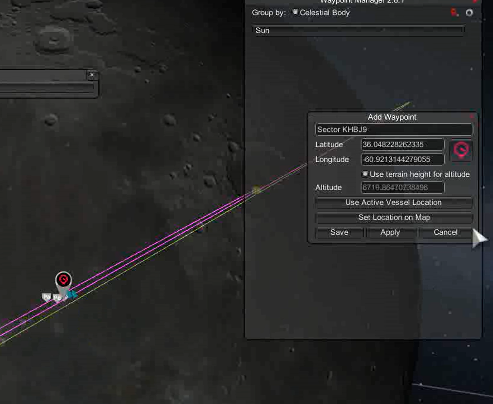

# Chris_KSP_Lib
适用于KSP原版或RSS/RO环境的KOS脚本。

视频演示：

- [[KSP/RSS/RO]PEGLand: 你也许能找到的最方便的定点着陆脚本](https://www.bilibili.com/video/BV1wDd2YDEf1)
- [[KSP/RSS/RO]PEGLand v0.3: 早期探测器一键自动定点落月](https://www.bilibili.com/video/BV1ZJdZY6EwE)
- [[KSP/RSS/RO]PEGLand v0.3阿波罗登月特别版：厘米级优雅着陆](https://www.bilibili.com/video/BV1wGdZYjEgm)
- [[KSP/RSS/RO]PEGLand 0.7: 通用定点着陆制导，支持目视修正](https://www.bilibili.com/video/BV1yUT6z4ExF)

## MOD 列表

- KSP-1.12.5
- kOS: Scriptable Autopilot System-1.4.0.0
- WaypointManager (Recommended for pegland)

## 安装

这不是游戏mod，而是一系列依赖于kOS系统的脚本。下载最新的release，解压后移动到`<游戏根目录>\Ships\Script`文件夹，完成后`<游戏根目录>\Ships\Script\pegland.ks`这个路径是存在的。

## PEG 着陆

`pegland`是这个脚本包中最精彩的程序，从1980s NASA为航天飞机项目开发的PEG发射制导算法修改而来，实现真空环境下燃料最优的定点着陆。

参考文献：[An explicit solution to the exoatmospheric powered flight guidance and trajectory optimization problem for rocket propelled vehicles | Guidance, Navigation, and Control and Co-located Conferences](https://arc.aiaa.org/doi/10.2514/6.1977-1051)

### 算法原理

PEGLand包含三个制导段：

- 下降段 (descent phase)，从着陆轨道减速下降，瞄准着陆点附近。首先估计点火位置，在滑行到点火位置后，使用PEG算法迭代预测着陆点并更新控制参数，实现燃料最优的下降。如果航天器的引擎具有60%的节流能力，下降段是精确的；
- 接近段 (approach phase)，从着陆点附近缓慢移动到着陆点上方50cm处。使用和阿波罗任务相同的二次制导算法，将着陆误差减少到分米级。接近段需要航天器有深节流引擎，能够允许航天器悬停，如果不具备条件可以取消接近段；
- 最终段 (final phase)，从着陆点上方缓慢下降，消除横向速度，以5cm/s的速度触地。

### 使用PEGLand

```kOS
run pegland(P_GUI, P_PREC, P_NOWAIT, P_ADJUST, P_ENGINE)
参数:
   P_GUI: 打开GUI。默认为true
   P_PREC: 添加接近段，高精度着陆。默认为false
   P_NOWAIT: 立刻启动下降程序，不要等待滑行至点火位置(即GUI窗口中的ignite_now)，默认为 false
   P_ADJUST: 目标修正向量。默认为 V(0,0,0)
   P_ENGINE: 引擎模式。
      “current”: (默认)使用当前已激活的引擎
      <标签>: 搜索符合标签的引擎，在点火时激活。在固体火箭时尤其有用
```

**示例：**

```kOS
run pegland.  // 打开PEGLand GUI
run pegland(0,1,1). // 不打开GUI，立刻启动引擎执行下降，添加接近段
run pegland(0,0,0,V(0,0,0),"descent"). // 不打开GUI，使用标签为"descent"的引擎参数计算
run pegland(0,0,0,V(-50,10,1)).  // 移动目标：向南50米，向东10米，向上1米
```

### PEGLand GUI

在激活PEGLand制导并开始迭代计算之前，我强烈推荐你点击`Analyze Orbit`按钮快速分析一下你的着陆轨道，查看你是否具备着陆条件。它会给你两个指标，还有推荐的取值范围。在推荐的范围内，着陆过程的燃料需求基本都是一样的。但如果你偏离太远，会导致严重的燃料浪费，甚至制导发散。

- `descent distance`: 目标着陆点正上方的轨道高度。从过高的轨道开始下降，航天器需要向下俯仰加速，才能在有限时间内触及地面；而对于过低的轨道，航天器需要花费燃料维持高度。
- `lateral distance`: 着陆点偏离轨道平面的距离。PEGLand需要控制偏航角修正法向误差，法向距离过大会增加燃料消耗，甚至导致制导发散。



在大多数情况下，你可以在PEGLand GUI中一键操作完成制导设置，并且可以在着陆过程中动态地调整参数。基本设置包含

- `Active`: 激活/停止制导程序。激活该按钮会让制导程序立刻开始计算并按计划执行着陆，停止制导会导致制导程序还原为初始状态
- `Ignite Now`: 立刻点火，不等待航天器滑行到点火位置
- `Add Approach Phase`: 添加接近段以实现精确着陆
- `start phase`: 从哪个制导段开始。如果你离地面已经很近了，速度也不快，可以从`final phase`开始软着陆
- `Roll`: 航天器滚转角
- `Emergency Suppress`: 紧急停止。立刻停止kOS对飞行器的姿态和油门控制，将控制权交还给你。



#### 调整着陆点

你可以点击`current waypoint`或手动输入着陆点经纬度，**并点击`update target`**设置着陆点。在着陆过程中，如果你发现原来的着陆点不适合着陆，PEGLand还提供了非常方便的目视调整功能。点击`show target`在HUD上显示着陆位置，随后点击调整按钮，向前后左右东西南北移动着陆点，每次点击移动的距离可以在`Moving step`中设置。

`Find landing site within`按钮是更自动化的方法，它会在原来的目标周围一定范围内随机撒点，并寻找最平坦的着陆点。它还会告诉你新着陆点的坡度。



**注意：**

- 仅有下降段和接近段允许调整着陆点
- 调整着陆点过多可能会导致制导发散
- 尽量在距离着陆点还远时调整
- 对于不具备节流能力的航天器，调整着陆点的意义不大



#### 调整下降段目标

下降段目标需要人工设定，在大部分情况下默认设置足够满足要求。但也许你需要调整这些参数使接近段表现更符合预期：




主下降段目标由四个参数定义：

- `RT`: 距离地面高度
- `VRT`: 垂直下降速度
- `LT`: 距离目标水平距离
- `VLT`: 水平速度

接近段用时大约为 $4.5\times LT/VLT$，接近段时间较长时会浪费燃料，油门也可能超过物理限制，时间较短则可能导致着陆精度不足。

#### Tips

1. 确保航天器满足着陆要求：充足的Δv，如果末段推重比范围包含1，推荐加入接近段以实现更优雅的着陆

2. 无论是GUI还是命令行模式下，PEGLand都会试图读取激活的导航点。你可以通过WaypointManager设置导航点，这样就可以免去手工输入经纬度的麻烦

   

3. 对于浅节流和不节流发动机，很遗憾我无法保证着陆精度（NASA的那帮天才也不能），不过你可以在坎巴拉中先模拟着陆一次，再根据着陆误差调整着陆点，这样可以把误差缩小到100米

4. 如果在最终着陆时推重比下限高于2，注意了，这样做比猎鹰九号的自杀式着陆更危险

5. 目前PEGLand仅支持单级火箭着陆，但你可以在着陆过程中切换引擎或分级，随后按下"0"键，程序会更新引擎参数。未来PEGLand不会针对多级火箭优化，虽然数学上可行，但预测未来分级的引擎参数超级麻烦

6. 在kOS终端输入命令时，其他的mod可能会被意外激活，比如**Advanced fly-by-wire (P)**。这些自动驾驶类mod会和kOS争夺控制权，导致飞船剧烈摇摆。**关闭其他自动驾驶，比如SAS，MechJeb和Advanced fly-by-wire**。

## 执行机动节点

`exe_node`和`exe_pulse_node`是两个适用于Principia环境下的高精度机动节点执行程序。在Principia中规划的机动节点考虑了燃烧过程，在时间较长的机动节点中，期间燃烧方向和位置的变化，以及天体引力的影响不可忽略。另外，RO发动机的推力不恒定，导致燃烧计时无法精确反映Δv。`exe_node`和`exe_pulse_node` 不采用计时的方法，而是通过维护一个Δv积分器直接精确监测燃烧过程中积攒的Δv.

- `exe_node`执行Principia机动节点，点火从节点位置开始，始终跟随目标燃烧矢量
- `exe_pulse_node`执行stock机动节点，点火从节点位置前`T/2`时刻开始

## 规划轨道圆化机动

执行`circularize`会在远地点规划一个加速机动节点以圆化轨道。`circularize(1)`在近地点规划减速机动。

