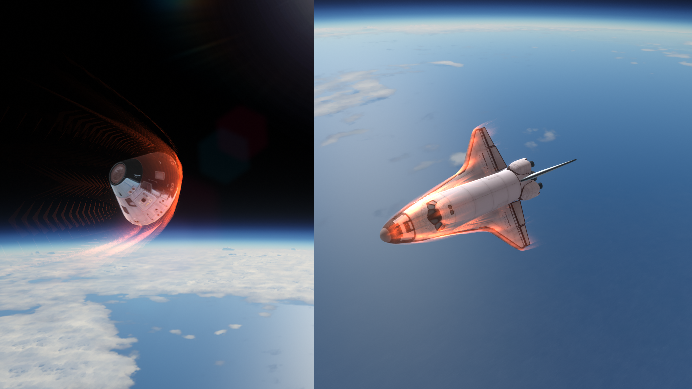

# Chris GNC Suite
坎巴拉太空计划先进制导控制研究。

Chris GNC Suite是一个强大的自动驾驶模组，其中包含的PEGLand和UEntry程序可以让您在月球或地球上精确着陆航天器。

- 实现燃料最优、精确、真实（如同阿波罗计划）且安全的动力定点着陆，适用于月球或任何其他无大气层的天体，几乎支持所有合适的着陆器设计；

- 为航天飞机或返回舱提供温和、精确且真实的升力再入引导，帮你把飞行器飞回航天中心，或任意其他有合适大气层的星球上的基地；

- 高精度机动节点执行器，支持原版节点和 Principia 节点。

虽然 Chris GNC Suite 的前端使用 kOS 编写，但您无需学习 kOS 脚本语法。PEGLand 和 UEntry 应用程序都配备了用户友好的图形化界面。

请参见[安装方法](#安装)安装模组和脚本，阅读[教程](./docs/中文/README.md)学习使用。

**KSP论坛页面:** [Chris GNC Suite](https://forum.kerbalspaceprogram.com/topic/229673-1125chris-gnc-suite-advanced-guidance-and-control-research-for-kerbal-space-program/)

如果你在使用中遇到了问题，请在Github提一个issue，或者通过以下渠道联系我：

- QQ群: 839542496，请在群里@Chris
- Discord: bilbo_04_71051
- [Discord KSP-RO server](https://discord.gg/cxxHuGywV): @Chris in RP-1 general
- Email: gchrispan@gmail.com

## 视频演示

- [[KSP/RSS/RO]PEGLand: 你也许能找到的最方便的定点着陆脚本](https://www.bilibili.com/video/BV1wDd2YDEf1)
- [[KSP/RSS/RO]PEGLand v0.3: 早期探测器一键自动定点落月](https://www.bilibili.com/video/BV1ZJdZY6EwE)
- [[KSP/RSS/RO]PEGLand v0.3阿波罗登月特别版：厘米级优雅着陆](https://www.bilibili.com/video/BV1wGdZYjEgm)
- [[KSP/RSS/RO]PEGLand 0.7: 通用定点着陆制导，支持目视修正](https://www.bilibili.com/video/BV1yUT6z4ExF)
- [UEntry: 如何专业且优雅地把航天飞机飞回跑道(Part 1)](https://www.bilibili.com/video/BV1dAcFz5ECu)
- [UEntry: 如何驾驶梦舟飞船从月球飞回文昌(Part2)](https://www.bilibili.com/video/BV1QncPzEEKC)

## MOD 列表

- KSP 1.12.5
- kOS: Scriptable Autopilot System 1.4.0.0
- KSPBurst Compiler 1.5.5.2 (Required by UEntry)
- Ferram Aerospace Research Continued 0.16.1.2 (Required by UEntry)
- WaypointManager (Recommended for PEGLand and UEntry)

## 安装

### 通过CKAN安装

使用CKAN搜索`Chris GNC Suite`并安装，kOS脚本和计算后端DLL文件将被自动安装到位。

### 手动安装

首先安装全部模组依赖，再选择以下任意一个下载链接下载安装包：

- [SpaceDock](https://spacedock.info/mod/4126/Chris%20GNC%20Suite)
- [Github Releases](https://github.com/ChrisInBed/Chris_KSP_Lib/releases/latest)，选择`Chris_GNC_Suite-v<版本号>.zip`项目下载

解压后可以看到两个文件夹：

- `Ships`: 把它移动到`<游戏根目录>\`文件夹中，完成后`<游戏根目录>\Ships\Script\pegland.ks`这个路径是存在的。
- `GameData`: 把它移动到`<游戏根目录>\`文件夹中，完成后`<游戏根目录>\GameData\kOS-Addons\AFS\kOS-AFS.dll`这个路径是存在的。

## 使用教程

[使用教程](./docs/中文/README.md)
