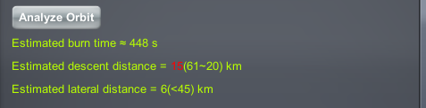
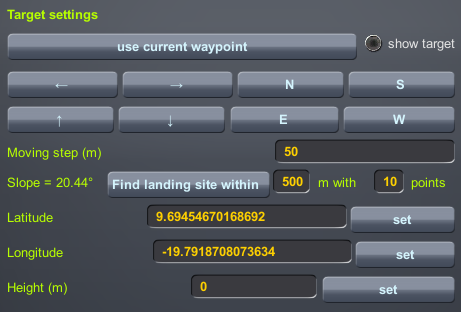
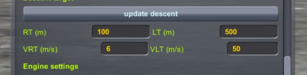

# PEGLand: Pinpoint Powered Landing Guidance

`pegland` is one of the most exciting programs in this mod, adapted from the PEG launch guidance algorithm developed by NASA in the 1980s for the Space Shuttle program, achieving fuel-optimal pinpoint landing in a vacuum environment.

Reference: [An explicit solution to the exoatmospheric powered flight guidance and trajectory optimization problem for rocket propelled vehicles | Guidance, Navigation, and Control and Co-located Conferences](https://arc.aiaa.org/doi/10.2514/6.1977-1051)

## Algorithm Principles

PEGLand contains three guidance phases:

- **Descent Phase**: Decelerates from landing orbit and descends, aiming near the landing point. First estimates the ignition position, then after coasting to the ignition position, uses the PEG algorithm to iteratively predict the landing point and update control parameters, achieving fuel-optimal descent. The descent phase is accurate if the spacecraft engine has 60% throttle capability;
- **Approach Phase**: Slowly moves from near the landing point to 50cm above the landing point. Uses the same quadratic guidance algorithm as the Apollo missions to reduce landing error to the decimeter level. The approach phase requires the spacecraft to have deep-throttling engines capable of hovering; if conditions are not met, the approach phase can be skipped;
- **Final Phase**: Descends slowly from above the landing point, eliminates lateral velocity, and touches down at 5cm/s.

## Using PEGLand

```kOS
switch to 0.  // Switch to the flight center's document system
run pegland(P_GUI, P_PREC, P_NOWAIT, P_ADJUST, P_ENGINE)
Parameters:
   P_GUI: Open GUI. Default is true
   P_PREC: Add approach phase for high-precision landing. Default is false
   P_NOWAIT: Start descent program immediately without waiting to coast to ignition position (i.e., ignite_now in GUI window). Default is false
   P_ADJUST: Target correction vector. Default is V(0,0,0)
   P_ENGINE: Engine mode.
      "current": (default) Use currently activated engines
      <label>: Search for engines matching the label and activate at ignition. Especially useful for solid rockets
```

**Examples:**

```kOS
run pegland.  // Open PEGLand GUI
run pegland(0,1,1). // Don't open GUI, start engine descent immediately, add approach phase
run pegland(0,0,0,V(0,0,0),"descent"). // Don't open GUI, use engines labeled "descent" for calculations
run pegland(0,0,0,V(-50,10,1)).  // Move target: 50m south, 10m east, 1m up
```

## PEGLand GUI

Before activating PEGLand guidance and starting iterative calculations, I strongly recommend you click the `Analyze Orbit` button to quickly analyze your landing orbit and check if you meet landing conditions. It will give you two indicators with recommended value ranges. Within the recommended range, fuel requirements for the landing process are basically the same. But if you deviate too far, it will cause serious fuel waste or even guidance divergence.

- `descent distance`: Orbital altitude directly above the target landing point. Descending from too high an orbit requires the spacecraft to pitch down and accelerate to reach the ground in a limited time; for too low an orbit, the spacecraft needs to spend fuel maintaining altitude.
- `lateral distance`: Distance of the landing point from the orbital plane. PEGLand needs to control yaw angle to correct normal errors; excessive normal distance increases fuel consumption and may even cause guidance divergence.



In most cases, you can complete guidance setup with one click in the PEGLand GUI and dynamically adjust parameters during landing. Basic settings include:

- `Active`: Activate/stop guidance program. Activating this button will cause the guidance program to immediately start calculating and execute landing as planned; stopping guidance will return the guidance program to its initial state
- `Ignite Now`: Ignite immediately without waiting for the spacecraft to coast to the ignition position
- `Add Approach Phase`: Add approach phase to achieve precise landing
- `start phase`: Which guidance phase to start from. If you're already very close to the ground and not moving fast, you can start soft landing from `final phase`
- `Roll`: Spacecraft roll angle
- `Emergency Suppress`: Emergency stop. Immediately stops kOS control of the vehicle's attitude and throttle, returning control to you.


### Adjusting the Landing Point

You can click `current waypoint` or manually enter the landing point latitude and longitude, **and click `update target`** to set the landing point. During landing, if you find the original landing point unsuitable, PEGLand also provides a very convenient visual adjustment function. Click `show target` to display the landing position on the HUD, then click the adjustment buttons to move the landing point forward, backward, left, right, or in cardinal directions. The distance moved with each click can be set in `Moving step`.

The `Find landing site within` button is a more automated method that will randomly sample points within a certain range around the original target and find the flattest landing site. It will also tell you the slope of the new landing site.



**Note:**

- Only descent and approach phases allow landing point adjustments
- Excessive landing point adjustments may cause guidance divergence
- Try to adjust when still far from the landing point
- For spacecraft without throttle capability, adjusting the landing point has limited significance

### Adjusting Descent Phase Targets

Descent phase targets need to be set manually, though in most cases the default settings are sufficient. But you may need to adjust these parameters to make approach phase performance more as expected:




Main descent phase targets are defined by four parameters:

- `RT`: Altitude above ground
- `VRT`: Vertical descent velocity
- `LT`: Horizontal distance from target
- `VLT`: Horizontal velocity

Approach phase duration is approximately $4.5\times LT/VLT$. Longer approach phase duration wastes fuel and throttle may exceed physical limits; shorter duration may result in insufficient landing accuracy.

## Tips

1. Ensure the spacecraft meets landing requirements: sufficient Δv. If final stage thrust-to-weight ratio range includes 1, recommend adding approach phase for more elegant landing

2. Whether in GUI or command-line mode, PEGLand will try to read the active waypoint. You can set waypoints through WaypointManager, saving the trouble of manually entering latitude and longitude

   

3. For shallow-throttling and non-throttling engines, unfortunately I cannot guarantee landing accuracy (NASA's geniuses can't either), but you can simulate a landing once in Kerbal, then adjust the landing point based on landing error, which can reduce error to 100 meters

4. If the lower bound of thrust-to-weight ratio at final landing is higher than 2, be careful - this is more dangerous than Falcon 9's suicide burn

5. Currently PEGLand only supports single-stage rocket landings, but you can switch engines or stage during landing, then press the "0" key, and the program will update engine parameters. PEGLand will not be optimized for multi-stage rockets in the future - while mathematically feasible, predicting engine parameters for future stages is super troublesome

6. When entering commands in the kOS terminal, other mods may be accidentally activated, such as **Atmosphere Autopilot (P)**. These autopilot mods will compete with kOS for control, causing the ship to shake violently. **Turn off other autopilots like SAS, MechJeb, and Atmosphere Autopilot**.
