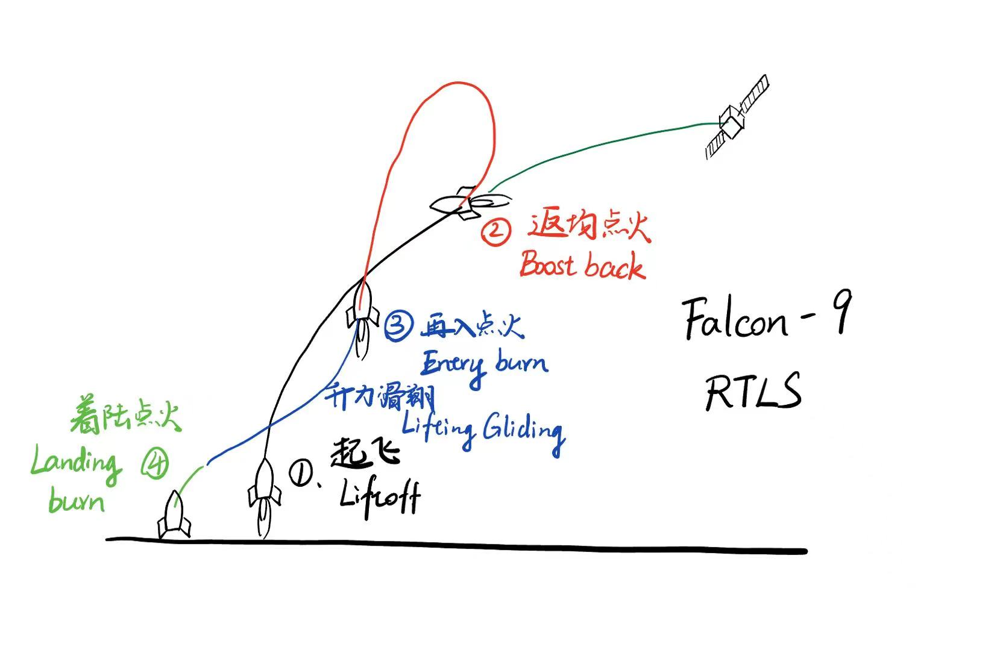
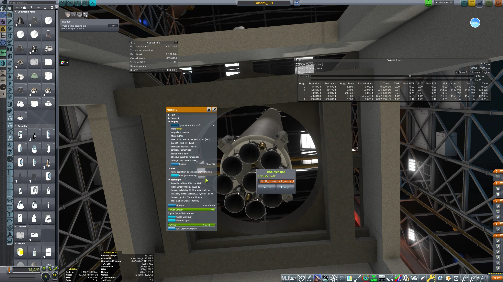

# BORG —— Booster Operation, Recovery and Guidance

切换到[English version](../English/BORG.md)。

## 1. 程序简介

**BORG** (**Booster Operation, Recovery and Guidance**) 是一套正在开发中的 kOS 通用助推器回收程序。通过撰写参数配置，它可以支持多种助推器的定点回收。BORG 同时面向陆上和无人船回收，并以支持 Falcon 9 式与 New Glenn 式回收方案为设计目标。

BORG 的主要特点是：

- **感知硬件配置：**在分配用途标签后，程序会自动找到对应的发动机组，读取推力、最低节流、推力方向和启动特性，并自动采样飞行器的 FAR 气动配置用于轨迹预测；
- **灵活多用：**助推返回、再入、气动下降和着陆使用的发动机组可以重叠，也可以不同，飞行器不需照搬某一种助推器的硬件布局；
- **着陆目标多样：**可以飞向固定经纬度、指定航点，或无人回收船一类的移动飞行器。

当前 BORG 前端由两套相互独立的 kOS 程序组成，用于控制一枚两级火箭及其可回收一级：

- `f9ascent.ks` 负责基础发射、程序转弯、一级关机、级间分离和二级点火。
- `f9recovery.ks` 负责分离后的助推返回、再入点火、气动修正和着陆。

回收程序使用 `kOS-LTR` 插件估算一级将会落在哪里，并不断把预测落点修正到回收启动文件中指定的着陆场。

> [!NOTE]
> BORG 仍在开发中。不同飞行器仍然需要调整与硬件有关的限制参数，试飞时请保留足够余量。

> [!IMPORTANT]
> 本项目自带的上升制导只是一个**非常简单的开环程序转弯**，它与一级回收制导**完全独立**。你不必使用它。
>
> 你可以使用 MechJeb、PEGAS、其他 kOS 程序，甚至完全手动发射。回收程序只关心一级分离后的状态。但是，**你必须自己保证一级剩下足够的燃料、可用的发动机和能够挽救的轨迹。** 如果上升阶段把一级燃料烧光了，再好的回收程序也不可能把它救回来。

## 2. 一次完整飞行的简单流程



1. 二级的 kOS CPU 加载可选的上升启动文件，等待动作组 10。
2. 一级的 kOS CPU 加载回收启动文件，等待级间分离。
3. 按下 `0` 键切换动作组 10，启动自带的发射程序；也可以使用其他制导方式发射。
4. 分离后，一级通过质量变化确认自己已经成为独立飞行器，并开始回收。
5. 一级执行助推返回点火，向设定的着陆场修正落点。
6. 一级执行再入点火，并在下降过程中进行气动修正。
7. 一级执行着陆点火，展开着陆腿，并在接地时关机。

上升和回收不需要共用一套制导程序。级间分离就是两个独立任务之间的交接点。

## 3. 搭建火箭前的准备

请安装并确认以下组件：

- kOS
- Ferram Aerospace Research（FAR）
- Chris GNC Suite v1.0.0 以上
- 一级和二级各一个 kOS CPU

仓库的 `/crafts` 目录中将提供一枚 Falcon 9 示例火箭。下面的发动机配置以这枚火箭为例。

## 4. 设置发动机标签

程序会检查每台发动机的 kOS 标签中是否包含启动文件指定的文字。因此，一台发动机可以在同一个组合标签中拥有多个用途。

我在本仓库中提供了一枚示例的Falcon-9火箭 [Falcon9_RP1](../../crafts/Falcon9_RP1.craft)，它完全使用RP-1环境中的零件建造，你可以把它作为例子学习如何使用。这枚火箭的 9 台一级发动机应当这样设置：

| 发动机 | 数量 | kOS 标签 |
|---|---:|---|
| 只用于起飞的外圈发动机 | 6 | `liftoff_` |
| 用于助推返回和再入点火的发动机 | 2 | `liftoff_boostback_entry_` |
| 用于最终着陆的中心发动机 | 1 | `liftoff_boostback_entry_landing2_` |

这些标签会产生以下发动机组：

- `liftoffEngineTag = "liftoff_"` 匹配全部 9 台发动机；
- `boostbackEngineTag = "boostback_"` 匹配中间 2 台和中心发动机，共 3 台；
- `entryEngineTag = "entry_"` 匹配同样的 3 台发动机；
- `landingEngineTag = "landing2_"` 只匹配中心发动机；
- `landingDecEngineTag = "landing1_"` 如果你需要在着陆阶段使用两组引擎，一组负责减速，另一组负责着陆，那么你可以把减速引擎打上这个标签。

这里采用的匹配逻辑非常简单，只要你的引擎标签中包含对应字符串，即被视为该组引擎。因此用户应当保证所设定的标签不会互相包含。比如`landingDecEngineTag = "land1", landingEngineTag = "land"`，这样设置会导致最终着陆引擎被一并视作减速引擎



## 5. 配置上升启动文件

以 [`Script/boot/f9ascent.ks`](../../Script/boot/f9ascent.ks) 为模板，根据你的火箭修改其中的 `F9_ASCENT_PARAMS` 词典。示例发动机布局应保留：

```ks
"liftoffEngineTag", "liftoff",
```

重点检查以下飞行器参数：

- `mecoMass`：一级主发动机关机时整枚火箭的质量，此时尚未分离的二级和载荷质量也必须计算在内；
- `targetHeading`：发射方位角；
- `targetRoll`：飞行器滚转角；
- `turnSpeed`：开始程序转弯的速度；
- `pitchOmega`：开环上升过程中的俯仰下降速率。

这个启动文件只是为了方便测试而提供的简单上升程序。它不会精确瞄准轨道，也不会优化燃料。如果你已经有更强的上升自动驾驶程序，可以完全不用它。
[PEGAS](https://github.com/Noiredd/PEGAS) 提供了基于PEG的上升制导，并且支持为可回收火箭一级预留燃料。

## 6. 配置回收启动文件

以 [`Script/boot/f9recovery.ks`](../../Script/boot/f9recovery.ks) 为模板，修改其中的 `F9_PARAMS` 字典。

示例发动机布局应使用：

```ks
"boostbackEngineTag", "boostback",
"entryEngineTag", "entry",
"landingDecEngineTag", "landing2",
"landingEngineTag", "landing2",
```

在这个示例中，中心发动机同时承担着陆初始减速和最终着陆。如果你的火箭在着陆初段使用多台发动机减速，也可以把 `landingDecEngineTag` 设置为对应的较大发动机组。

把 `boostBackMass` 设置为略高于一级分离后的预计质量，同时低于尚未分离时整枚火箭的质量。回收程序会一直等待，直到一级飞行器的质量低于这个数值。

### 选择着陆场

通过 `landingSiteUse` 选择一种着陆场来源。

**固定经纬度：**

```ks
"landingSiteUse", "geo",
"landingSiteGeo", LIST(经度, 纬度),
```

**指定名称的航点：**

```ks
"landingSiteUse", "waypoint",
"landingSiteWaypoint", "VAB",
```

**指定名称的飞行器，例如无人回收船：**

```ks
"landingSiteUse", "vessel",
"landingSiteVessel", "drone",
```

航点名和飞行器名必须完全一致。如果实际接地点高于或低于航点、飞行器的参考位置，可以使用 `altitudeOffset` 修正高度。

第一次试飞可以暂时保留示例回收启动文件中的其余预测、气动和着陆参数。它们与飞行器性能有关，以后可能需要通过试飞调整，但不需要逐条研究复杂公式才能开始使用。

## 7. 为两台 CPU 分配启动文件

在编辑器中完成以下设置：

1. 把 `f9recovery.ks` 设为**一级** kOS CPU 的启动文件。
2. 如果要使用自带的上升程序，把 `f9ascent.ks` 设为**二级** kOS CPU 的启动文件。
3. 检查主发动机启动、发射台释放、级间分离和二级点火的分级顺序。
4. 如果选择航点或飞行器作为目标，确认它在发射前已经存在。
5. 确认一级有足够的燃料和点火次数完成助推返回、再入点火和着陆。

回收启动文件会在发射前开始运行，但在飞行器质量低于设定的分离后质量之前，它不会指挥一级执行回收动作。

## 8. 发射示例火箭

1. 安装示例火箭 [Falcon9_RP1](../../crafts/Falcon9_RP1.craft)
2. 把火箭放到发射台上
3. 二级终端应显示 `Activate AG10 to enable launch.`
4. 按下键盘上的 `0`。在 KSP 中，这会切换动作组 10 并启动自带的发射程序
5. 观察分级，并确认分离后一级的回收信息界面开始更新
6. 二级点火后，上升程序会要求再次切换动作组 10。再按一次 `0`，释放它对二级转向和节流的锁定，然后使用你喜欢的制导方式继续二级飞行
7. 由于超出物理加载范围的航天器不再受控，所以你需要迅速切回一级，它正在回收途中。或者使用FMRS分别操控二级和一级。

如果使用 MechJeb、PEGAS 或手动上升，不要让二级运行自带的上升启动文件。正常发射和分离即可，一级上的回收 CPU 仍会独立执行自己的任务。

> [!WARNING]
> 回收制导独立，并不代表它不受物理条件限制。上升方案必须给一级留下足够的推进剂，不能制造无法修正的落点偏差，并且必须在发动机仍能重新点火时完成分离。**一级燃料余量由上升方案和玩家负责。**

## 9. 快速排查

- **按下 `0` 后没有发射：**确认二级 CPU 使用 `f9ascent.ks`，并确认动作组 10 已被激活。
- **程序找不到某组发动机：**检查组合发动机标签中的拼写和大小写。
- **分离后回收没有开始：**检查一级 CPU 的启动文件，并确认分离后一级质量低于 `boostBackMass`。
- **程序找不到着陆场：**检查 `landingSiteUse`，以及航点名或飞行器名是否完全一致。
- **一级燃料耗尽：**修改上升轨迹、MECO 时机、载荷质量或回收方案，为一级保留合理的燃料余量。
