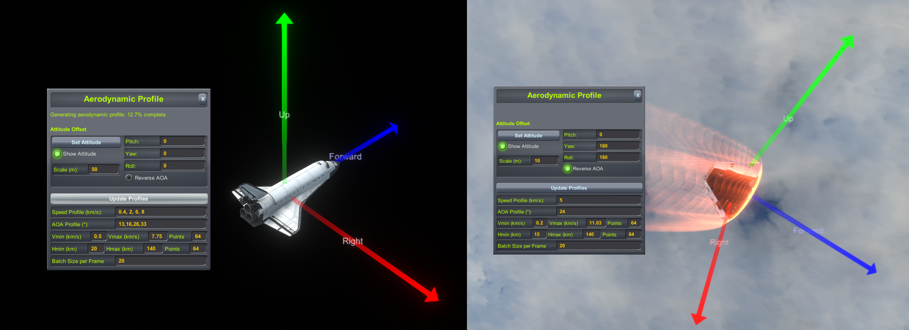

# UEntry: 通用大气升力再入制导

`uentry`是这个模组中最精彩的程序之一。1960-1980s NASA为他们的返回舱和航天飞机开发了再入制导程序，但受限于当时的计算机算力，制导算法中充满了各种经验参数和各种奇技淫巧，而今天我们得以在个人计算机上运行更为先进的制导算法，使用同一套算法引导多种航天器的再入过程。本算法从Lu等人于2013年发表的再入制导算法改进而来。UEntry能够实现：

- 高升阻比/低升阻比航天器，从低轨/飞掠轨道再入大气的精确定点制导
- 考虑热流、过载和动压约束，确保再入过程安全
- 再入轨道规划器：规划再入前的机动节点，预测可行的落点，提前计划再入过程

参考文献：[Entry Guidance: A Unified Method](https://arc.aiaa.org/doi/10.2514/1.62605)

## 算法原理

### 升力再入

早期返回舱采用**弹道再入**的方式回到地面，当返回舱坠入更稠密的大气时，阻力骤然增加，这使得飞船速度减慢，轨迹被重力向下拉，导致下降率增加，于是阻力增加得更快了，这一死亡螺旋一直持续到飞船的速度被降到足够低时才会结束，舱内勇敢的先驱者们要承受约10G的过载，即使是最优秀的驾驶员也无法把这一数字降低分毫。

于是工程师们想到了一个主意，他们把返回舱的重心偏向一侧，此时再入过程中返回舱出现了一个天然的攻角。返回舱在大气中不仅受到阻力，还有**升力**。这一宝贵的升力使得我们能够对抗重力，让航天器不要下坠得太快，在高层稀薄的大气中享受更平稳的刹车。同时由于驾驶员能够控制升力的方向，从而在某种程度上规划再入轨迹，落点也比弹道再入的方式更精确。采用升力再入方式的返回舱能够把落点范围控制在几千米内，而弹道式再入的落点误差高达几十公里。而航天飞机的升阻比相较返回舱更加优秀，甚至可以把再入的热流峰值减小50%以上，因此航天飞机不需要笨重的隔热层，

### 升力再入式航天器控制

- 攻角 (Angle of Attack, AOA, α)：飞行器气动平面和气流方向的夹角。对于大多数飞行器，升力和阻力随攻角增大而增加；
- 倾侧角 (Bank Angle, σ)：飞行器升力方向和垂直平面的夹角。


但实际操作中，再入航天器通常主要控制**倾侧角**，而**攻角**仅作为辅助控制，或完全不控制攻角，这主要有三个原因。

1. 攻角更难控制和维持。飞行器需要依靠RCS和气动控制面来控制攻角，它们能提供的控制力矩有限，因此飞行器可用的攻角范围是有限的。在平衡攻角外，如果使用RCS控制，将会消耗大量RCS燃料。而返回舱类型的航天器几乎完全没有俯仰控制，它们单纯依靠重心偏移造成的平衡攻角提供升力。相比之下，倾侧角控制方便地多，飞行器只需要滚转到对应的角度即可，不需要额外的力矩来维持。
2. 气动参数是攻角和速度的复杂函数。在对航天器的气动性质了解不全面的情况下，改变攻角会导致轨迹难以预测。而倾侧角与气动参数无关，只影响升力的方向，这使得制导计算的任务简单了很多。
3. 再入飞行器的安全攻角范围很狭窄，它们只有在特定的攻角范围内才能抵御前方等离子体的高温。航天飞机在再入段前段的攻角就被严格限制，可动范围只有2°。

倾侧角能够控制升力方向。当倾侧角为0时，升力在重力方向上的分量最大，飞船将更慢地进入大气，甚至被弹回太空；当倾侧角为90°时，升力在重力方向上的分量为0，飞船在高度剖面上的表现类似弹道再入。制导算法通过调整倾侧角控制下降率，下降率将影响未来的阻力，而阻力影响航程和落点位置，这使得我们有可能通过控制倾侧角实现落点控制。

在UEntry的基本策略中，攻角指令是由用户提前定义好的，关于速度的函数

$$\alpha_{cmd}=\alpha_{cmd}(v)$$

倾侧角指令是关于特征能量的线性函数：

$$\sigma_{base}(E)=\sigma_i+(\sigma_f-\sigma_i)\frac{E-E_i}{E_f-E_i}$$

其中特征能量 $$E=\frac12v^2-\frac{\mu}{r}$$

UEntry采用标准的预测-校正制导方法。在一个制导周期内，UEntry将从当前状态出发，积分动力学方程计算终点位置，再根据终点位置的误差更新制导参数$\sigma_i$（注意，$\sigma_f$是常数）。

在基本策略之外，UEntry还引入了两个额外的约束项：**准平衡滑翔条件(Quasi-Equilibrium Gliding Condition, QEGC)**和**物理边界约束**。

- 引入QEGC的目的是让轨迹更平滑。高升力飞行器喜欢在大气边界打水漂，这对于落点控制来说不太友好，因此需要QEGC约束项惩罚飞行路径角的大幅变化。这一约束的强度由$k_{QEGC}$参数控制。
- 物理边界约束则是控制热流、过载和动压不超过用户指定的边界。UEntry会在再入过程中动态预测未来一段时间（T-Lag）后的热流、过载和动压，如果它们某一项超过了边界值，物理约束项会对超出的部分施加惩罚。这一约束的强度由$k_C$参数控制。注意这不是硬边界，飞船状态仍有可能超越这些边界。

尽管UEntry能够对物理状态进行某种程度上的约束，但要清楚轨迹上的物理状态很大程度上取决于再入开始时的状态（再入界面，Entry Interface）。如果没有合适的初值，UEntry很难从高温、过载和超压中挽救飞船。


这是航天飞机的典型再入约束剖面，纵轴是阻力，横轴是速度。热流峰值发生在再入过程的早期，此时飞船尚位于空气极其稀薄的大气层边界，没有足够的升力可用，制导几乎无法控制热流峰值。因此您需要提前规划好再入轨道，让再入界面处的飞行路径角处于合理的范围。如果飞行路径角过大，飞船将快速扎进大气，造成不可控的超温和过载；如果路径角过小，飞船将被大气弹回太空。

### 横程控制

当你操控飞船倾侧到右侧时，不仅竖直方向上的升力减小，指向水平右侧方向的升力也增加了。这使得你的飞船具备一定的横程（Cross Range）机动能力，你将有机会飞到轨道平面以外的区域。高升阻比飞行器的横程机动能力更为优秀，航天飞机甚至能容忍上千公里的横程误差。UEntry采用非常简单的横程控制策略，当它发现目标的方位角和目前速度的朝向误差大于阈值（Heading Tol）时，UEntry会把倾侧方向换到另一侧。

## 使用UEntry

不同于PEGLand的便利性，UEntry需要进行一些设置才行正常运行，为了了解各个参数的作用，推荐你先阅读过[算法原理](#算法原理)章节后再看本章节。

### Step 1. 设定着陆目标

打开kOS终端，输入以下命令：

```kOS
switch to 0.  // 切换到航天中心的文档系统
run uentry.  // 运行UEntry
```

使用Waypoint Manager模组设定导航点并激活之，该导航点需要位于轨道面附近。随后在UEntry界面的`Target`一节设置合理的末端高度、速度，以及距离目标点的距离和方位。下图中的含义是：再入段目标位于已激活的导航点280°方位（西偏北10°）50千米处，高度20千米，速度500m/s

设定完成后，点击`Update Target`更新再入段目标。

⚠**注意**：注意天体自转。如果你安装了Principia，请使用体固参考系查看轨迹。


### Step 2. 计算气动参数

在UEntry界面中点击`Open Aerodynamic Profile GUI`按钮，弹出启动参数设置界面



#### 2-1. 设定再入姿态

你需要调整`Pitch, Yaw, Roll`后点击`Set Attitude`，正确的再入姿态为：`Forward`指向再入时的前方（攻角为0时），`Up`指向升力方向，`Right`指向飞船的右舷，上图中是两个正确示范。此外，你需要确保攻角为正时，升力指向`Up`方向，如果飞船不满足这一条件，你需要点选`Reverse AOA`使攻角反向。例如对于右图的Apollo指令舱来说，向下俯仰将产生正升力，因此需要使攻角反向。

#### 2-2. 设定攻角曲线

UEntry假设攻角是速度的函数，它会在你输入的$(Speed,AOA)$坐标点间插值，寻找当前速度对应的攻角。你需要在`Speed Profile`和`AOA Profile`中输入以逗号","分隔的一串数字，上下一一对应。

1. 如何获取可用攻角？
    - 对于航天飞机：SPH中，打开FAR模组的界面，设置俯仰为+1，模拟一定攻角范围内的俯仰力矩(Cm,黄色)曲线。该曲线与X轴的交点即为最大可用攻角。
    - 对于返回舱：可以用类似的方法获取。也可以在飞行场景中模拟返回舱的无控再入过程，观察平衡攻角。
2. ⚠**注意**：填入`Speed Profile`和`AOA Profile`中的数列必须等长。
3. ⚠**注意**：填入`Speed Profile`中的数列必须单调递增。
4. ⚠**注意**：使用英文逗号，而非中文的全角逗号

#### 2-3. 计算气动参数

UEntry计算一定高度和速度范围内的样本点的气动参数，在制导运行时使用二次线性插值获取气动参数。在下方设置高度和速度范围，以及格点数量。格点越多，数据越精确，但计算开销越大。总格点数量等于高度格点数×速度格点数。

设定完成后点击`Update Profiles`更新攻角曲线、计算格点。当格点数目为64x64时，此步大约需要几秒钟完成。

⚠**注意**：只能计算**当前航天器**的气动参数，无法预测未来分级的气动参数。比如对于Apollo飞船，你需要先分离服务舱，才能拿到指令舱的气动参数。可以这样做：存档->分离服务舱->计算气动参数后保存（保存方法参见[此节](#step-4-保存读取参数)）->读档回到分离前的状态->读取之前计算的气动参数。

⚠**注意**：你无法在其他天体的引力范围内计算目标天体上大气的气动参数。请等待航天器进入目标天体的SOI后再进行计算。

### Step 3. 规划再入机动和参数

准确且安全的再入过程 = 合理的再入轨道 + 合理的制导参数

在UEntry界面的Guidance Parameters一节设置好合适的制导参数（各制导参数的作用见下表）。如果你认为当前飞船不处于合适的再入轨道上，可以打开你喜欢的规划器规划一个机动节点。UEntry界面的最下方的两个按钮可以预测当前机动节点和参数设置下的末端位置（绿色为预测点，红色为目标点），并且在地图中显示出来。尝试设置不同的机动节点和制导参数，直到绿色箭头和红色箭头大致重合，以及信息框给出合适的状态。

⚠**注意**：你无法在其他天体的引力范围内计算目标天体上的着陆位置。请等待航天器进入目标天体的SOI后再进行规划。

⚠**注意**：UEntry的预测器是基于开普勒轨道计算的，如果你使用Principia，其他星体的引力摄动会导致偏差。你可以在Principia界面中选择`Display orbit patch`选项查看开普勒轨道和多体引力轨道的偏差，等待偏差足够小时再进行规划。

⚠**注意**：UEntry的大气内轨迹预测器上限是3600秒，如果该时间后飞行器仍无法完成减速，预测器将会给出`TIMEOUT`结果，这通常意味着飞行器减速不足，被弹回太空了。请尝试减小飞掠高度、增大`Initial Bank` `Final Bank` `Max Bank`，并检查约束参数。


**制导参数汇总**

|参数|描述|
|--|--|
|机动节点|再入界面处路径角越大，热流和过载峰值越高，航程越短；路径角过小可能会导致飞行器弹回太空|
|`Initial Bank`|即 $\sigma_i$ ，该值应小于`Max Bank`，其值越大，热流和过载峰值越高，航程越短，同时也影响横程机动能力。该值以`Max Bank`的2/3为最佳|
|`Final Bank`|即$\sigma_f$， 该值应小于`Max Bank`，其值越大，热流和过载峰值越高，航程越短，同时也影响横程机动能力。该值可以在0~`Max Bank`之间任意调节|
|`Max Bank`|允许的最大倾侧角|
|`Heading Tol`|允许的最大航向误差，当航向误差超过该值时触发反向倾侧机动。该值过小会导致反向倾侧机动过于频繁，影响再入精度；过大会导致航向误差无法被及时纠正。你也可以点击`Force Reversal`手动触发反向倾侧机动|
|`M.HeatFlux`|热流峰值边界|
|`M.Load`|过载峰值边界|
|`M.DynP`|动压峰值边界|
|`Min Lift`|最小升力加速度。再入过程中升力加速度低于该值时，仅启用基本策略；超过该值时，制导算法考虑QEGC和物理边界约束|
|`QEGC Gain`|QEGC约束强度。适当调大该值可以避免飞行器在大气层边界打水漂，让再入轨迹更平滑；但如果该值过大，会导致制导算法自由度下降，落点范围狭窄|
|`Constraint Gain`|物理状态约束强度。适当调大该值可以避免飞行器超过预测的物理状态边界；如果该值过大，会导致制导算法自由度下降，落点范围狭窄|
|`Lag T`|物理状态预测时间。当考虑物理状态约束时，制导算法会预测`Lag T`时间后的物理状态。当你的物理状态变化很快时，可以适当调小该值|

### Step 4. 保存/读取参数

设置完成后，你可以将这一套参数保存为一个预设(Preset)。在保存/读取一节中输入自定义的预设名称，并点击`Save`保存。预设文件存储在`<游戏根目录>\Ships\Script\entry_presets`文件夹中，你可以把这个文件分享给他人，或安装他人的预设文件。需要加载预设时，在读取选项中选择目标预设，并点击`Load`即可。

我也为大家提供了一些典型载具的预设文件，大家在设置自己的参数时，可以根据模板修改：

- `shuttle`: 航天飞机LEO返回的制导预设，模型来自benjee10的Shuttle Orbiter Construction Kit
- `Apollo`: Apollo指令舱从月球返回的制导预设，模型来自ROCapsules
- `Gemini`: Gemini返回舱从LEO返回的制导预设，模型来自ROCapsules

⚠**注意**：飞行器质量、气动外形对再入轨迹的影响很大，如果你的飞行器状态和预设不同，这会导致较大的误差


### Step 5. 激活再入制导

点击`ACTIVATE GUIDANCE`激活制导控制，它会在进入大气层前60秒开始调整再入姿态。由于UEntry的轨道预测器存在误差，请尽量在再入前10分钟内激活制导控制。

UEntry界面中的`Guidance State`一节显示关键的状态参数。大部分参数都不需要解释，重点是：

- `Bank_i` 即$\sigma_i$，该值应随时间平稳从初始$\sigma_i$过渡到$\sigma_f$。如果变化过快，通常意味着气动参数不准确，请更新气动参数；或飞控系统存在较大的误差，请调整飞控参数（见下）
- `AOA` 攻角。括号外是当前实际攻角，括号内是制导指令要求的攻角。如果偏差过大，请调整飞控参数（见下）
- `Bank` 倾侧角。括号外是当前实际倾侧角，括号内是制导指令要求的倾侧角。如果偏差过大，请调整飞控参数（见下）

UEntry内置飞控(KCL Controller)，但同一套飞控参数可能无法同时胜任高空高速段和低空低速段，当你的航天器控制出现以下问题时，可以采取对应的解决方案：

- 攻角误差无法消除
    - 如果飞行器俯仰控制接近极限，仍无法接近目标攻角，这意味着目标攻角超出了航天器的设计极限，请调整攻角曲线
    - 如果飞行器似乎并没有努力俯仰来接近目标攻角，请调大`Pitch Kp`和`Pitch Ki`
- 飞行器的控制在振荡
    - 请调小Pitch,Yaw或Roll对应的`Kp`和`Ki`，或调大`Kd`
    - 物理时间加速也可能导致控制振荡，上面的解决方法依然有效
- 飞行器滚转的速度过快/过慢
    - 请调整`Rotational Rate Controller`的`Upper`，此项指示最高允许的转动速率。`Upper = 5`代表每秒最多转5°

⚠**注意**：其他自动驾驶，如SAS, MechJeb Smart A.S.S., Atmosphere Autopilot等，会和UEntry争夺控制权，导致飞船剧烈摇摆或完全失控。请关闭它们。

⚠**注意**：在航天器能量低于用户设定的终端状态的能量之后，UEntry程序结束并放开控制权。如果你的航天器在低空不是气动静稳定的，它可能会失控，请迅速打开其他自动驾驶稳定航天器姿态。

Tips: 在高空阶段，气动控制面提供的力矩不足，飞船需要RCS来控制姿态。但随着高度降低，需要的力矩越来越大，此时再开启RCS会导致严重的燃料浪费。你需要逐步关闭各个RCS喷口的力度，从RCS平缓地过渡到气动控制面控制。

Tips: 返回舱在大气中有天然的平衡攻角，如果你的航天器试图平衡攻角以外的值，将会消耗大量RCS燃料。你可以在适当的时候点击`Pitch Damper Only`按钮，飞控系统就不再试图追踪命令攻角了。此时飞船的俯仰控制仅作为阻尼器使用，几乎不消耗燃料。

Tips: 点击`EMERGENCY SUPPRESS`将暂时断开kOS对航天器的控制。当UEntry表现奇怪时，你可以用这个功能手动接管航天器控制


